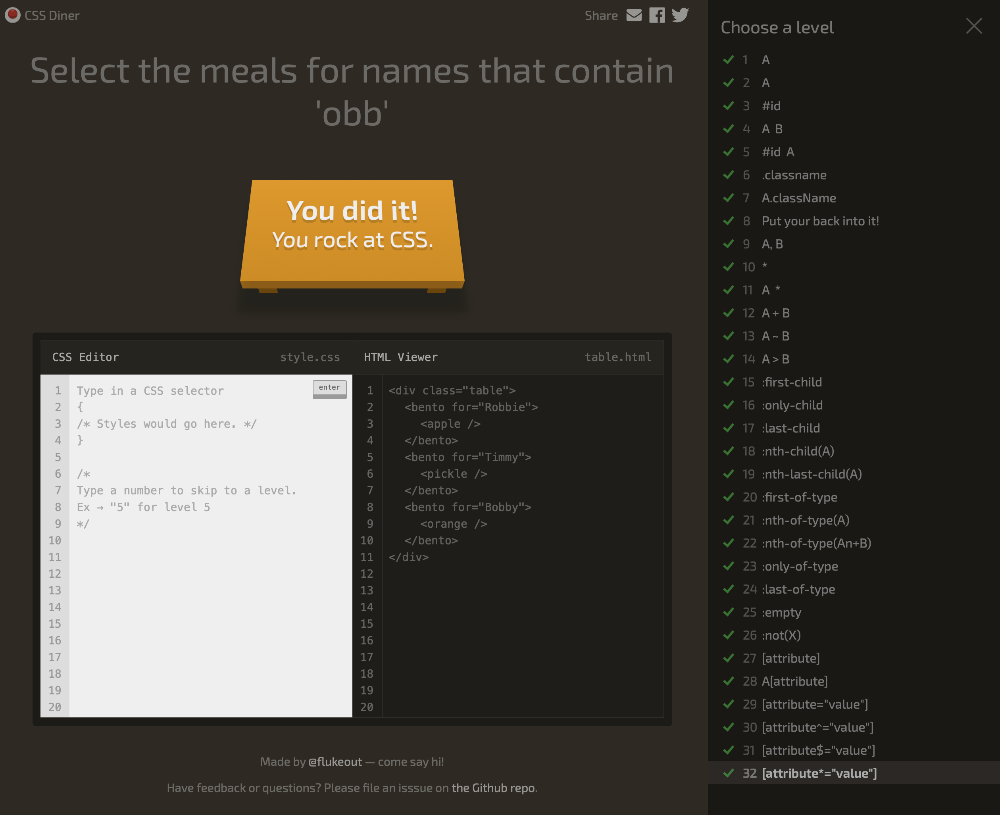

# The CSS Diner Game

CSS Diner is an interactive game designed to help web developers master CSS selectors in a fun and engaging way. As a developer, understanding how to precisely target HTML elements is crucial for building responsive and well-structured websites. CSS Diner provides a playful environment where you’re tasked with selecting specific elements from a virtual dinner table, using various CSS selectors.

Each level presents new challenges, from basic selectors like element and #id to more advanced ones like nth-of-type and attribute selectors. What makes CSS Diner so helpful is its ability to teach complex concepts through hands-on experience, progressively increasing difficulty as you advance through the levels. By visually seeing the effects of your selections, you gain a deeper understanding of how CSS interacts with the DOM—essential knowledge for building modern websites.

For any developer wanting to sharpen their CSS skills or for beginners needing to grasp the power of selectors, CSS Diner makes the learning process both enjoyable and highly effective!

## Learning objectives

- Type Selectors
- ID Selectors
- Class Selectors
- Attribute Selectors
- Advanced Attribute Selectors
- Pseudo-class selectors
- Advanced Pseudo-class Selectors

## Requirements

- [ ] Visit the [CSS Diner](https://flukeout.github.io) game web app.
- [ ] Complete ALL levels.
- [ ] Submit the screenshot of the game that follows the "Acceptance criteria" though the submission form in the Devslopes learning platform.

## Acceptance Criteria

- [ ] The screenshot includes "You did it! You rock at CSS." message.
- [ ] The screenshot includes the levels list with all the levels marked with the "green" color

Example:

