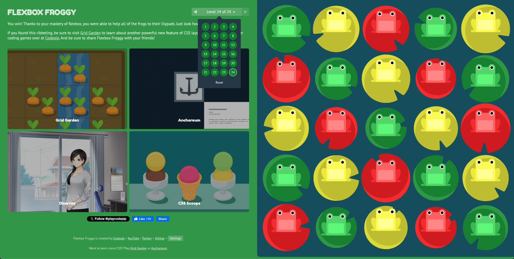

# The Flexbox Froggy Game

Flexbox Froggy is an interactive game designed to help web developers master CSS Flexbox in a fun and engaging way. As a developer, understanding how to create flexible and responsive layouts is crucial for building modern, adaptable websites. Flexbox Froggy provides a playful environment where you're tasked with helping frogs reach their lilypads using various Flexbox properties.
Each level presents new challenges, from basic concepts like justify-content and align-items to more advanced combinations of Flexbox properties. What makes Flexbox Froggy so helpful is its ability to teach complex layout concepts through hands-on experience, progressively increasing difficulty as you advance through the levels. By visually seeing how your Flexbox declarations affect the positioning of the frogs, you gain a deeper understanding of how Flexbox creates dynamic layouts—essential knowledge for modern web development.
For any developer wanting to strengthen their layout skills or for beginners needing to grasp the power of Flexbox, Flexbox Froggy makes the learning process both enjoyable and highly effective!

## Learning Objectives

- Understand and apply fundamental Flexbox concepts
- Master flex container properties like justify-content, align-items, and flex-direction
- Learn how to create responsive layouts using Flexbox
- Practice implementing various Flexbox combinations to solve layout challenges
- Develop practical skills in modern CSS layout techniques

## Requirements

- [ ] Visit the [Flexbox Froggy game web app](https://flexboxfroggy.com/).
- [ ] Complete ALL 24 levels.
- [ ] Submit the screenshot of the game that follows the "Acceptance criteria" through the submission form in the Devslopes learning platform.

## Acceptance Criteria

- [ ] The screenshot includes "You win! Thanks to your mastery of flexbox, you were able to help all of the frogs to their lilypads" message
- [ ] The screenshot includes the levels list with all 24 levels marked as complete (indicated by the green lily pad)
Example:

